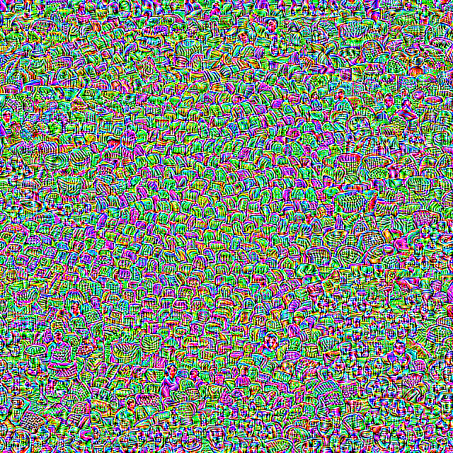

# Daedalus-RT

Wouldn't it be funny to mess with literally every other submission to the YOLO26 MLX Build Challenge? Introducing Daedalus-RT:


## Attack Overview

Imagine your "friend" (rival?) is also participating in the YOLO26 MLX Build Challenge, and has made the mistake of targeting the same submission track as you. After gloating about their obviously inferior project, they make the second mistake of leaving their laptop open and unlocked to use the restroom. Within those ~10 minutes, you can insert Daedalus-RT to undetectably sabotage their code.

Daedalus-RT is a real-time, on-device, YOLO26-MLX version of the adversarial attack first proposed in [this 2020 paper](https://arxiv.org/abs/1902.02067). Object detectors use non-maximal suppression (NMS) to filter out duplicate overlapping detections, so if we slightly perturb an image to minimize the size and maximize the confidence of all predicted bounding boxes, we can flood NMS with non-overlapping false positives.

... at least in theory. The original Daedalus attack requires re-optimization for every image, taking 10+ minutes per frame. If your friend is using YOLO26 MLX, clearly latency is a high priority and it would raise far too many red flags to completely crater it. [This 2016 paper](https://arxiv.org/abs/1610.08401) demonstrated that you can learn a single filter that breaks detection on *any* image (a "universal" adversarial perturbation, UAP), and [this 2023 paper](https://openaccess.thecvf.com/content/WACV2023/papers/Shapira_Phantom_Sponges_Exploiting_Non-Maximum_Suppression_To_Attack_Deep_Object_Detectors_WACV_2023_paper.pdf) already extended it to a Daedalus-style NMS attack. So Daedalus-RT takes the same approach, bringing the attack's latency from minutes to microseconds. Just compositing this (highly amplified) UAP over each frame is sufficient to break YOLO26-n:



There is one more giant problem: **YOLO26 doesn't use non-maximal suppression.** This is the first version to make the switch, and it's noted as a [major efficiency improvement](https://docs.ultralytics.com/models/yolo26) in their docs. Ultralytics replaced it with a simple top-k confidence threshold (supporting up to 300 detections). Turns out that **this is even more vulnerable than NMS!** We don't need to worry about making bounding boxes non-overlapping; we just have to crank up the confidence of enough false positives to flood the 300 limit.

### Real-Time Demo


There is essentially 0 impact to latency, yet it completely destroys YOLO26 MLX's ability to detect objects. Injecting the attack into your friend's codebase can be as simple as these 3 lines, meaning you really could do this while they're in the bathroom:

```python
clean = current_video_frame.astype(np.float32) / 255.0
delta = np.load("delta_final.npy")
adv = (np.clip(clean + delta, 0.0, 1.0) * 255).astype(np.uint8)
```

I've included a demo script `visualize_attack.py` to demonstrate the attack on a single image (dependencies: opencv-python, numpy, ultralytics, yolo26mlx):

```python
python visualize_attack.py IMAGE --delta delta_final.npy --model yolo26n.npz
```

To see a live video demo (same dependencies):

```python
python camera_demo.py --model yolo26n.npz
```

To train the attack yourself on YOLO26-n (val2017 is the path to the COCO 2017 validation set; additional dependencies are torch, tqdm, scikit-image):

```python
python daedalus_yolo26.py --mode universal --image-dir val2017/ --epochs 10 --batch-size 8
```

## Technical Details

| Stage | Hardware | Model |
|-------|----------|-------|
| Training | NVIDIA A6000 GPU | YOLO26-n |
| Eval | Apple M1 Pro | YOLO26-n (MLX) |

Though Daedalus-RT was only trained on YOLO26-n for its accelerated training speed, prior literature already demonstrated that Daedalus is effective against a broad range of CNN-based object detectors, so I expect Daedalus-RT to have no issues with the larger models as well.
